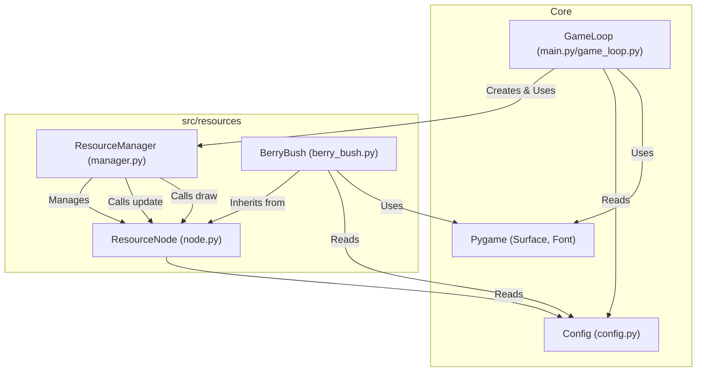

# Plan for Epic 1, Slice 1.2: Basic Resource Generation

**Goal:** Implement resource nodes (Berry Bushes) that generate resources over time and are visually represented on the grid.

**Technical Implementation Steps:**

1.  **Create `src/resources` Directory:** If it doesn't exist, create a new directory `src/resources` to hold resource-related code. Create `__init__.py` inside it.
2.  **Define `ResourceNode` Base Class (`src/resources/node.py`):**
    *   Create a base class `ResourceNode`.
    *   Attributes: `position` (tuple/Vector2), `capacity` (int), `current_resources` (int/float), `generation_rate` (float, resources per tick/second).
    *   Methods:
        *   `__init__(self, position, capacity, generation_rate)`: Initialize attributes.
        *   `update(self, dt)`: Abstract method or base implementation to increment `current_resources` based on `generation_rate` and `dt` (delta time from the game loop), capped by `capacity`.
        *   `draw(self, surface, font)`: Abstract method for drawing.
        *   `collect(self, amount)`: Method to decrease `current_resources` when collected (will be used in later slices).
3.  **Implement `BerryBush` Subclass (`src/resources/berry_bush.py`):**
    *   Create `BerryBush` class inheriting from `ResourceNode`.
    *   `__init__`: Call parent `__init__`, potentially set specific default capacity/rate for berries.
    *   `update`: Implement the resource accumulation logic if not fully done in the base class.
    *   `draw`: Implement drawing logic:
        *   Draw a green square at the node's `position`. Use `config.py` for color and potentially size.
        *   Render the `current_resources` count as text overlayed on the square. Requires a `pygame.font.Font` object passed in.
4.  **Create `ResourceManager` (`src/resources/manager.py`):**
    *   Create `ResourceManager` class.
    *   Attributes: `nodes` (list to store `ResourceNode` instances).
    *   Methods:
        *   `__init__(self)`: Initialize the empty `nodes` list.
        *   `add_node(self, node)`: Add a resource node instance to the list.
        *   `update_nodes(self, dt)`: Iterate through `self.nodes` and call each node's `update(dt)` method.
        *   `draw_nodes(self, surface, font)`: Iterate through `self.nodes` and call each node's `draw(surface, font)` method.
5.  **Integrate into Core Game (`main.py` / `src/core/game_loop.py`):**
    *   Import necessary classes (`ResourceManager`, `BerryBush`, `Config`, `random`, `pygame`).
    *   Initialize Pygame Font module (`pygame.font.init()`) and create a font object.
    *   Instantiate `ResourceManager`.
    *   In the setup phase (before the main loop):
        *   Determine grid boundaries from `Config`.
        *   Create a specified number (e.g., 5-10) of `BerryBush` instances.
        *   For each bush, generate a random `position` within the grid boundaries. Ensure positions align with the grid if necessary.
        *   Add each created `BerryBush` to the `ResourceManager` using `add_node`.
    *   In the game loop's `update` phase: Call `resource_manager.update_nodes(dt)`.
    *   In the game loop's `render` phase: Call `resource_manager.draw_nodes(surface, font)`.
6.  **Update Configuration (`src/core/config.py`):**
    *   Add configuration options like:
        *   `BERRY_BUSH_COLOR = (0, 128, 0)` (Green)
        *   `BERRY_BUSH_CAPACITY = 100`
        *   `BERRY_BUSH_GENERATION_RATE = 1` (e.g., 1 resource per second)
        *   `INITIAL_BERRY_BUSHES = 10`
        *   `RESOURCE_TEXT_COLOR = (255, 255, 255)`
        *   `RESOURCE_FONT_SIZE = 16`
        *   Potentially `NODE_SIZE = (grid_cell_width, grid_cell_height)` if nodes should fit grid cells.

**Mermaid Diagram of Class Interactions:**

**Testing Criteria (from `breakdown.md`, adapted):**

*   Berry bushes (green squares) appear on the grid at random locations.
*   Resource counts (text overlays) start at 0 or an initial value and increase over time.
*   Resources accumulate at a consistent rate based on `BERRY_BUSH_GENERATION_RATE` and simulation ticks/time.
*   Resource generation stops once `BERRY_BUSH_CAPACITY` is reached.
*   `ResourceManager` correctly tracks and updates all created berry bushes.
*   The simulation continues to run smoothly with the added resource logic.