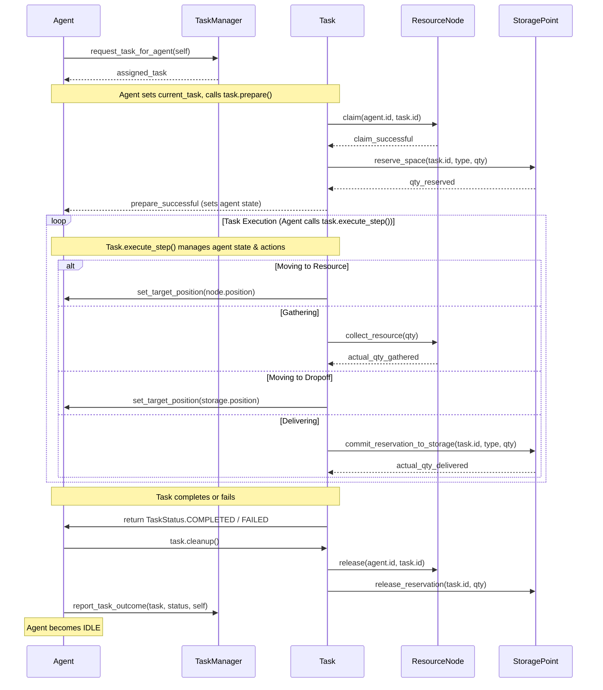

# Plan for Implementing a Task System

This plan outlines the introduction of a task-based system to manage agent behavior, resource claiming, and coordination.

**1. Goals of the Task System:**
    *   **Encapsulate Complexity:** Move multi-step behavior logic out of the `Agent` class and into `Task` objects.
    *   **Improve State Management:** Centralize task-related state (targets, quantities, reservations) within `Task` objects.
    *   **Enhance Scalability:** Make it easier to add new complex agent behaviors by defining new `Task` types.
    *   **Enable Centralized Coordination:** Allow a `TaskManager` to oversee task generation, prioritization, and assignment.
    *   **Improve Robustness:** Provide clearer mechanisms for failure handling and resource reservation.
    *   **Solve Specific Issues:** Address storage race conditions and resource over-collection.

**2. New Core Components & File Structure:**

*   **`src/tasks/task_types.py`**:
    *   `TaskType(Enum)`: e.g., `GATHER_AND_DELIVER`, `PROCESS_RESOURCE`, `COLLECT_PROCESSED_AND_DELIVER`.
    *   `TaskStatus(Enum)`: e.g., `PENDING`, `ASSIGNED`, `PREPARING` (for claims/reservations), `IN_PROGRESS_MOVE_TO_RESOURCE`, `IN_PROGRESS_GATHERING`, `IN_PROGRESS_MOVE_TO_DROPOFF`, `IN_PROGRESS_DELIVERING`, `COMPLETED`, `FAILED`, `CANCELLED`.

*   **`src/tasks/task.py`**:
    *   `Task(ABC)`: Base class for all tasks.
        *   **Attributes:**
            *   `task_id: uuid.UUID` (for unique identification)
            *   `task_type: TaskType`
            *   `status: TaskStatus`
            *   `priority: int`
            *   `agent_id: Optional[uuid.UUID]` (or agent object reference)
            *   `creation_time: float`
            *   `last_update_time: float`
            *   `error_message: Optional[str]`
        *   **Abstract Methods:**
            *   `prepare(self, agent: 'Agent', resource_manager: 'ResourceManager') -> bool`: Handles initial claims and reservations. Returns `True` if successful.
            *   `execute_step(self, agent: 'Agent', dt: float, resource_manager: 'ResourceManager') -> TaskStatus`: Advances the task logic. Returns the new status of the task.
            *   `cleanup(self, agent: 'Agent', resource_manager: 'ResourceManager', success: bool)`: Releases claims/reservations, notifies `TaskManager`.
            *   `get_target_description(self) -> str`: For debugging/UI.
    *   `GatherAndDeliverTask(Task)`: A concrete implementation.
        *   **Additional Attributes:**
            *   `target_resource_node_id: Optional[uuid.UUID]` (or node object reference)
            *   `target_dropoff_id: Optional[uuid.UUID]` (or storage/processor object reference)
            *   `resource_type_to_gather: ResourceType`
            *   `quantity_to_gather: int`
            *   `quantity_gathered: int`
            *   `quantity_to_deliver: int`
            *   `quantity_delivered: int`
            *   `reserved_at_node: bool` (or reference to claim)
            *   `reserved_at_dropoff_quantity: int`
            *   `_current_step_index: int` (internal step management for multi-stage tasks)

*   **`src/tasks/task_manager.py`**:
    *   `TaskManager`:
        *   **Attributes:**
            *   `pending_tasks: List[Task]` (sorted by priority)
            *   `assigned_tasks: Dict[uuid.UUID, Task]` (agent_id -> Task)
            *   `completed_tasks: List[Task]` (for history/metrics)
            *   `failed_tasks: List[Task]` (for analysis/retry)
            *   `resource_manager_ref: 'ResourceManager'`
            *   `agent_manager_ref: 'AgentManager'`
        *   **Methods:**
            *   `create_gather_task(resource_type: ResourceType, quantity: int, priority: int, target_dropoff_category: Optional[str] = None) -> Optional[Task]`: Generates a new `GatherAndDeliverTask`.
            *   `add_task(task: Task)`
            *   `assign_task_to_agent(agent: 'Agent') -> bool`: Finds a suitable pending task and assigns it.
            *   `request_task_for_agent(agent: 'Agent') -> Optional[Task]`: Agent calls this when idle.
            *   `report_task_outcome(task: Task, final_status: TaskStatus, agent: 'Agent')`: Called by `Agent` or `Task` upon completion/failure.
            *   `update()`: Periodic updates, e.g., re-prioritizing, generating recurring tasks.
            *   `get_task_by_id(task_id: uuid.UUID) -> Optional[Task]`

**3. Modifications to Existing Classes:**

*   **`src/agents/agent.py` (`Agent` class):**
    *   **Remove:** `target_resource_node`, `target_storage_point`, `target_processing_station`, `gathering_timer`, `delivery_timer`, complex decision logic in `update()` related to finding targets and managing collection/delivery sequences.
    *   **Add:**
        *   `id: uuid.UUID` (assign in `__init__`)
        *   `current_task: Optional[Task] = None`
        *   `task_manager_ref: Optional['TaskManager'] = None` (passed during init or set later)
    *   **Modify `__init__`:** Accept `id` and `task_manager_ref`.
    *   **Modify `update(dt: float, resource_manager)`:**
        1.  If `current_task` is `None` and `state` is `IDLE`:
            *   Call `self.task_manager_ref.request_task_for_agent(self)`.
            *   If a task is assigned:
                *   Set `self.current_task = assigned_task`.
                *   Set `self.current_task.agent_id = self.id`.
                *   Call `self.current_task.prepare(self, resource_manager)`.
                *   If `prepare` fails, report failure to `TaskManager`, set `current_task` to `None`, remain `IDLE`.
                *   Else, the task's `prepare` or first `execute_step` should set the agent's initial state (e.g., `MOVING_TO_RESOURCE`).
        2.  If `current_task` is not `None`:
            *   `new_task_status = self.current_task.execute_step(self, dt, resource_manager)`.
            *   The `execute_step` method within the task will now be responsible for changing `agent.state` as needed (e.g., `agent.state = AgentState.MOVING_TO_RESOURCE`).
            *   If `new_task_status` is `COMPLETED` or `FAILED` (or `CANCELLED`):
                *   `self.current_task.cleanup(self, resource_manager, success=(new_task_status == TaskStatus.COMPLETED))`.
                *   `self.task_manager_ref.report_task_outcome(self.current_task, new_task_status, self)`.
                *   `self.current_task = None`.
                *   `self.state = AgentState.IDLE`.
    *   Agent's `_move_towards_target` will still be used, but the `target_position` will be set by the `Task` object.
    *   The `AgentState` enum might need fewer specific states if tasks manage sub-steps internally, or tasks can map their internal steps to existing agent states. For now, assume tasks will set existing `AgentState`s.

*   **`src/agents/manager.py` (`AgentManager` class):**
    *   Modify `__init__`: Optionally accept a `TaskManager` reference or create one.
    *   Modify `create_agent`: Ensure new agents get an `id` and a reference to the `TaskManager`.
    *   The `update_agents` method remains largely the same, as it just calls `agent.update()`.

*   **`src/resources/node.py` (`ResourceNode` class):**
    *   Modify `claim()`:
        *   `claim(self, agent_id: uuid.UUID, task_id: uuid.UUID) -> bool`
        *   Change `is_targeted: bool` to `claimed_by_task_id: Optional[uuid.UUID] = None` and `claimed_by_agent_id: Optional[uuid.UUID] = None`.
        *   Claiming succeeds if `claimed_by_task_id` is `None`.
    *   Modify `release()`:
        *   `release(self, agent_id: uuid.UUID, task_id: uuid.UUID)`: Only release if `task_id` matches `claimed_by_task_id`.
        *   Set `claimed_by_task_id = None` and `claimed_by_agent_id = None`.
    *   The `collect_resource` method will be called by the `Task` object.

*   **`src/resources/storage_point.py` (`StoragePoint` class):**
    *   **Add Attributes:**
        *   `reservations: Dict[uuid.UUID, int] = {}` (task_id -> reserved_quantity)
    *   **Add Methods:**
        *   `get_available_capacity_for_reservation() -> int`: `overall_capacity - get_current_load() - sum(reservations.values())`.
        *   `reserve_space(self, task_id: uuid.UUID, resource_type: ResourceType, quantity: int) -> int`:
            *   Checks `accepted_resource_types`.
            *   Checks `get_available_capacity_for_reservation()`.
            *   If successful, adds `task_id: quantity_reserved` to `self.reservations`.
            *   Returns actual quantity reserved.
        *   `release_reservation(self, task_id: uuid.UUID, quantity: int) -> bool`: Removes or reduces reservation for `task_id`.
        *   `commit_reservation_to_storage(self, task_id: uuid.UUID, resource_type: ResourceType, quantity_to_add: int) -> int`:
            *   Checks if `task_id` has a reservation for at least `quantity_to_add`.
            *   Calls `add_resource(resource_type, quantity_to_add)`.
            *   Decrements/removes the reservation from `self.reservations`.
            *   Returns actual quantity added.
    *   Modify `can_accept()`: To also consider `self.reservations` when checking available space for new, non-reserved additions.
    *   Modify `add_resource()`: This method will now primarily be used by `commit_reservation_to_storage` or for direct, non-task-related additions if any.

*   **`src/resources/manager.py` (`ResourceManager` class):**
    *   Likely no major changes needed immediately, as `TaskManager` will use its existing methods (`get_nodes_by_type`, `get_storage_points`, etc.) to find potential targets for tasks.
    *   May need methods to get nodes/storage by ID if tasks store IDs instead of direct references.

**4. Workflow Example (GatherAndDeliverTask):**

1.  **Task Creation:** `TaskManager` creates a `GatherAndDeliverTask` (e.g., "Gather 10 Berries, deliver to Storage X").
2.  **Task Assignment:** An `Agent` becomes `IDLE`, requests a task. `TaskManager` assigns this task.
3.  **Task Preparation (`task.prepare()`):**
    *   The task identifies a suitable `ResourceNode` (e.g., nearest Berry Bush with >0 berries, not fully claimed).
    *   Calls `node.claim(agent.id, self.task_id)`.
    *   The task identifies a suitable `StoragePoint`.
    *   Calls `storage.reserve_space(self.task_id, ResourceType.BERRY, 10)`. Stores `quantity_reserved_at_dropoff`.
    *   If claims/reservations succeed, `prepare` returns `True`. Task status might become `IN_PROGRESS_MOVE_TO_RESOURCE`. Agent state set by task.
4.  **Task Execution (`task.execute_step()` called by `agent.update()`):**
    *   **Step 1: Move to Resource:** Task sets `agent.target_position` to node. Agent moves.
    *   **Step 2: Gather Resource:** Once at node, task initiates gathering (e.g., sets `agent.state = GATHERING_RESOURCE`, manages a timer internally or via agent).
        *   Agent calls `node.collect_resource(min(agent.inventory_capacity, self.quantity_to_gather, node.current_quantity))`.
        *   Task updates `self.quantity_gathered`.
    *   **Step 3: Move to Dropoff:** Task sets `agent.target_position` to storage. Agent moves.
    *   **Step 4: Deliver Resource:** Once at storage, task initiates delivery.
        *   Agent calls `storage.commit_reservation_to_storage(self.task_id, self.resource_type, self.quantity_gathered)`.
        *   Task updates `self.quantity_delivered`.
5.  **Task Completion/Failure:**
    *   If all steps successful, `execute_step` returns `TaskStatus.COMPLETED`.
    *   If any step fails (e.g., node depleted before gathering, storage full despite reservation due to an error), `execute_step` returns `TaskStatus.FAILED`.
    *   Agent calls `task.cleanup()` (releases claims/reservations).
    *   Agent notifies `TaskManager.report_task_outcome()`.
    *   Agent becomes `IDLE`.

**5. Addressing Current Problems:**

*   **Storage Race Condition:** Solved by `StoragePoint.reserve_space()`. A task reserves space *before* the agent gathers the resource. The agent only gathers up to the amount that can be delivered to the reserved space.
*   **Over-Collection:** Solved because the `Task` specifies `quantity_to_gather`, which can be `min(node_has, agent_capacity, task.quantity_reserved_at_dropoff)`.

**6. Transitioning Strategy:**

1.  Implement `TaskType`, `TaskStatus` enums.
2.  Implement the base `Task` class and a simple `GatherAndDeliverTask`.
3.  Implement `StoragePoint` reservation methods.
4.  Implement `ResourceNode` enhanced claim methods.
5.  Implement the `TaskManager` with basic task creation (`create_gather_task`) and assignment logic (`request_task_for_agent`, `report_task_outcome`).
6.  Modify `Agent` class: Add `current_task`, `id`, `task_manager_ref`. Simplify `update()` to delegate to `current_task.execute_step()` and request tasks when idle.
7.  Integrate `TaskManager` into `AgentManager` or main simulation loop.
8.  Start by having `TaskManager` generate one type of task (e.g., `GatherAndDeliverTask` for Berries).
9.  Gradually replace old agent logic for other resources/actions with new task types.

**7. Mermaid Diagram of Key Interactions:**

