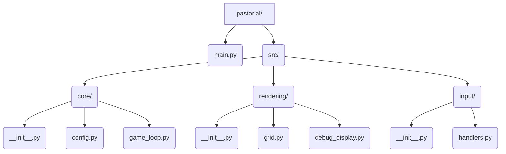

# Refined Plan: Epic 1, Slice 1.1 - Functional Game Window

**Goal:** Create a functional Pygame window with a basic grid, fixed timestep loop, configuration management, basic input handling, and an FPS debug display.

**Project Structure:**

**Refined Implementation Steps:**

1.  **Create Project Structure:** Set up the directories (`src/core`, `src/rendering`, `src/input`) and files (`main.py`, `src/core/__init__.py`, `src/core/config.py`, `src/core/game_loop.py`, etc.) as shown in the diagram.
2.  **Initialize Pygame & Config:**
    *   In `src/core/config.py`, define initial constants like `SCREEN_WIDTH`, `SCREEN_HEIGHT`, `TARGET_FPS`, `GRID_CELL_SIZE`, `GRID_COLOR`.
    *   In `main.py`, initialize Pygame and create the display surface using values from `config.py`.
3.  **Implement Fixed Timestep Loop:**
    *   Create the game loop logic (handling input, updates, rendering, and time delta) in `src/core/game_loop.py`.
    *   Instantiate and run the loop from `main.py`.
4.  **Create Grid Visualization:**
    *   Implement a function in `src/rendering/grid.py` to draw a grid based on `config.py` settings (cell size, color).
    *   Call this drawing function during the render phase of the game loop in `main.py`.
5.  **Add Basic Input Handling:**
    *   Implement a function in `src/input/handlers.py` to check for the `pygame.QUIT` event.
    *   Call this function during the input handling phase of the game loop in `main.py` to allow closing the window.
6.  **Set Up Debug Information:**
    *   Implement functions in `src/rendering/debug_display.py` to calculate and render the current FPS.
    *   Call this during the render phase of the game loop in `main.py`.

**Testing Criteria (Confirm Success):**

*   Window opens at the resolution defined in `config.py`.
*   The grid is drawn correctly using the specified cell size and color.
*   The game loop runs, and the FPS counter displays a value close to `TARGET_FPS`.
*   The window closes cleanly when the close button is clicked.