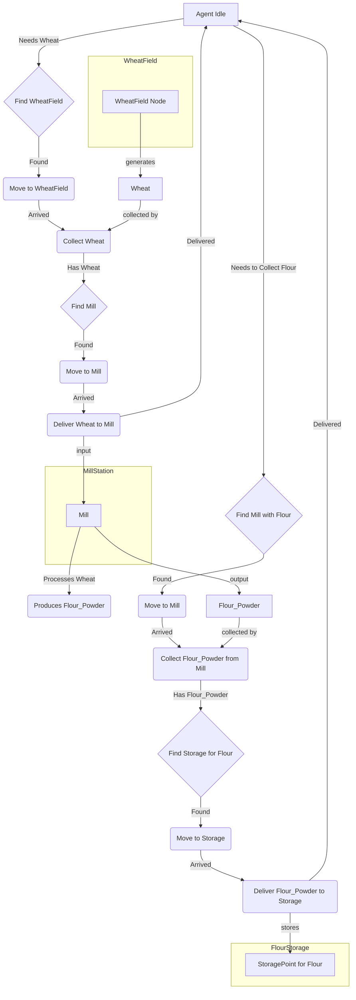

# Implementation Plan: Slice 3.1 - Basic Processing (Wheat to Flour)

**Goal:** Implement the first step in the resource processing chain, enabling agents to gather wheat, deliver it to a mill, have the mill process it into flour, and then store the flour.

**Key Components & Changes:**

1.  **Resource Type Definitions (`src/resources/resource_types.py`):**
    *   Add new resource types:
        *   `WHEAT = "WHEAT"`
        *   `FLOUR_POWDER = "FLOUR_POWDER"`
    *   Ensure these are integrated into any relevant enum or list of resource types.

2.  **WheatField Resource Node (`src/resources/wheat_field.py` - New File):**
    *   Create class `WheatField(ResourceNode)`.
    *   **Attributes:**
        *   `resource_type = ResourceType.WHEAT`
        *   `generation_rate = 1` (units of wheat)
        *   `generation_interval = 5` (simulation ticks per unit generated)
        *   `capacity = 50` (max wheat it can hold)
        *   `position` (inherited)
        *   `current_quantity` (inherited)
    *   **Visuals:** Simple yellow square (details to be refined during rendering implementation).
    *   **Logic:** Inherit resource accumulation logic from `ResourceNode`.

3.  **ProcessingStation Base Class (`src/resources/processing.py` - New File):**
    *   Create class `ProcessingStation`:
        *   **Attributes:**
            *   `accepted_input_type: ResourceType` (e.g., WHEAT)
            *   `produced_output_type: ResourceType` (e.g., FLOUR_POWDER)
            *   `conversion_ratio: float` (e.g., 1.0 meaning 1 input unit -> 1 output unit)
            *   `processing_speed: int` (ticks per unit processed)
            *   `input_capacity: int` (max input resource it can hold)
            *   `output_capacity: int` (max processed resource it can hold before needing collection)
            *   `current_input_quantity: int`
            *   `current_output_quantity: int`
            *   `is_processing: bool`
            *   `processing_progress: int` (ticks accumulated towards current unit)
            *   `position` (x, y)
        *   **Methods:**
            *   `__init__(self, position, accepted_input_type, produced_output_type, conversion_ratio, processing_speed, input_capacity, output_capacity)`
            *   `receive(self, resource_type: ResourceType, quantity: int) -> bool`: Adds input resource. Returns true if successful.
            *   `tick(self)`: Handles processing logic per simulation tick.
                *   If `current_input_quantity > 0` and `current_output_quantity < output_capacity`:
                    *   Increment `processing_progress`.
                    *   If `processing_progress >= processing_speed`:
                        *   Decrement `current_input_quantity` by 1 (or based on `conversion_ratio`).
                        *   Increment `current_output_quantity` by 1 (or based on `conversion_ratio`).
                        *   Reset `processing_progress`.
                        *   Set `is_processing = True`.
                *   Else: `is_processing = False`.
            *   `dispense(self, quantity: int) -> int`: Allows an agent to collect processed output. Returns actual quantity dispensed.
            *   `can_accept_input(self, resource_type: ResourceType) -> bool`: Checks if it can accept the given resource type and has space.
            *   `has_output(self) -> bool`: Checks if there are processed goods to collect.
            *   `get_visual_state(self) -> str`: Returns "idle" or "processing".

4.  **Mill Subclass (`src/resources/mill.py` - New File):**
    *   Create class `Mill(ProcessingStation)`:
        *   **`__init__(self, position)`:**
            *   Call `super().__init__(position, ResourceType.WHEAT, ResourceType.FLOUR_POWDER, conversion_ratio=1.0, processing_speed=8, input_capacity=25, output_capacity=25)`.
    *   **Visuals:** Specific visual representation for a mill (details TBD), changing based on `get_visual_state()`.

5.  **ResourceManager (`src/resources/manager.py`):**
    *   Modify to register and manage `WheatField` and `Mill` instances.
    *   Add methods:
        *   `get_nearest_station_accepting(self, position, resource_type: ResourceType) -> Optional[ProcessingStation]`
        *   `get_stations_with_output(self, resource_type: ResourceType) -> List[ProcessingStation]`

6.  **StoragePoint (`src/resources/storage_point.py`):**
    *   Modify `StoragePoint` to be more generic:
        *   Change `accepted_resource_type` to `accepted_resource_types: List[ResourceType]` in `__init__`.
        *   Update `can_store()` and `store_resource()` to check against this list.
        *   When creating `StoragePoint` instances for flour, they will be initialized to accept `ResourceType.FLOUR_POWDER`.

7.  **Agent Logic (`src/agents/agent.py`):**
    *   **State Machine & Decision Making:**
        *   **Finding Wheat:** Existing logic for finding `ResourceNode`s can be adapted.
        *   **Delivering Wheat to Mill:**
            *   Agent finds `nearest_station_accepting(ResourceType.WHEAT)`.
            *   `DELIVERING` state logic adapted for `ProcessingStation` targets (call `target.receive()`).
        *   **Collecting Flour from Mill:**
            *   Agent finds `Mill` that `has_output()` of `FLOUR_POWDER`.
            *   `GATHERING`/`COLLECTING` state adapted for `ProcessingStation` targets (call `target.dispense()`).
        *   **Delivering Flour to Storage:**
            *   Agent finds `StoragePoint` accepting `FLOUR_POWDER`.
            *   `DELIVERING` state logic reused.
    *   **Agent Inventory:** Ensure it can handle different resource types.

8.  **Game Loop / Main Simulation (`main.py` or `src/core/game_loop.py`):**
    *   Instantiate `WheatField`s, `Mill`s, and `StoragePoint`s for flour.
    *   Ensure `ProcessingStation.tick()` is called for all mill instances.

9.  **Rendering (`src/rendering/` modules):**
    *   Add rendering logic for `WheatField`s.
    *   Add rendering logic for `Mill`s (idle/processing states).
    *   Ensure `FLOUR_POWDER` visualization if applicable.

## Mermaid Diagram (Conceptual Flow)

## Testing Criteria (from `breakdown.md`)

*   Wheat fields generate wheat resources.
*   Agents gather wheat and deliver to mill.
*   Mill processes wheat into flour at specified rate (8 ticks/unit).
*   Flour is stored correctly (in adapted `StoragePoint`s).
*   Processing stations (Mills) show visual state (idle/processing).