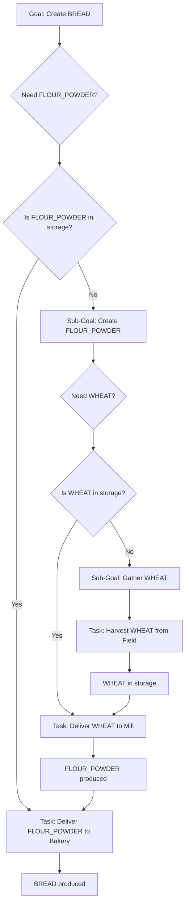

# Architectural Plan: Task Dependency Graph

## 1. Overview

This document outlines a long-term architectural solution to replace the current conflicting task generation systems in the `TaskManager`. The current implementation uses two separate logics:
1.  **Global Stock Management:** Creates gathering tasks when the global supply of a resource (e.g., `FLOUR_POWDER`) drops below a certain threshold.
2.  **Recipe Provisioning:** Creates delivery tasks to bring ingredients directly to processing stations that need them for their current recipe.

These systems are in conflict, leading to redundant tasks and inefficient resource allocation. The proposed **Dependency Graph** model will unify them into a single, intelligent, and demand-driven system.

The core concept is that the `TaskManager` will no longer reactively manage stock levels. Instead, it will fulfill high-level goals (e.g., "produce 5 `BREAD`") by recursively resolving dependencies. When a task to create a resource is requested, the `TaskManager` will first check if the required input ingredients are available. If not, it will generate prerequisite tasks to acquire those ingredients, creating a chain or "graph" of dependent tasks.

## 2. Example Workflow: Producing `BREAD`

Let's consider a request to produce one unit of `BREAD`. The recipe for `BREAD` requires `FLOUR_POWDER`.

1.  **Goal:** Create `BREAD`.
2.  **Dependency Check:** The `TaskManager` checks the recipe for `BREAD` and identifies a dependency on `FLOUR_POWDER`.
3.  **Resource Query:** It queries the `ResourceManager` to see if sufficient `FLOUR_POWDER` is available in any storage point.
    *   **If YES:** A task is created to deliver the `FLOUR_POWDER` to the `Bakery`.
    *   **If NO:** The `TaskManager` treats "Acquire `FLOUR_POWDER`" as a new sub-goal.
4.  **Sub-Goal:** Acquire `FLOUR_POWDER`.
5.  **Dependency Check (Flour):** The `TaskManager` knows `FLOUR_POWDER` is produced by a `Mill` from `WHEAT`. It identifies a dependency on `WHEAT`.
6.  **Resource Query (Wheat):** It queries the `ResourceManager` for available `WHEAT`.
    *   **If YES:** A task is created to deliver `WHEAT` to an available `Mill`.
    *   **If NO:** The `TaskManager` treats "Acquire `WHEAT`" as a new sub-goal.
7.  **Sub-Goal:** Acquire `WHEAT`.
8.  **Base Task Generation:** `WHEAT` is a raw resource gathered from a `WheatField`. The `TaskManager` generates a `GatherAndDeliverTask` for an agent to harvest `WHEAT` and deliver it to a storage point.
9.  **Task Execution Chain:** As the tasks are completed, the dependencies are resolved in reverse order:
    *   `WHEAT` is harvested and stored.
    *   The task to deliver `WHEAT` to the `Mill` can now begin.
    *   The `Mill` produces `FLOUR_POWDER`.
    *   The task to deliver `FLOUR_POWDER` to the `Bakery` can now begin.
    *   The `Bakery` produces `BREAD`. The initial goal is complete.

## 3. Mermaid Diagram

This diagram illustrates the dependency flow. The system starts with the end goal (`BREAD`) and works backward to generate the initial tasks.

## 4. Pros and Cons

### Pros

*   **Unified Logic:** Eliminates the two conflicting systems, simplifying the `TaskManager`'s logic and removing sources of bugs.
*   **Scalability:** Easily supports complex, multi-stage recipes without requiring new hardcoded logic for each intermediate resource. Adding a new recipe is trivial.
*   **Efficiency:** As a demand-driven system, it only generates tasks for resources that are actually needed to fulfill a goal, preventing over-production of intermediate goods.
*   **Clarity & Debuggability:** The chain of tasks is explicit. When a task fails, it's easier to trace the dependencies and understand the impact on the overall goal.

### Cons

*   **Implementation Complexity:** The initial implementation of the dependency resolution logic is more complex than the current systems. It requires careful management of task states and dependencies.
*   **Performance:** For very deep dependency chains, the initial planning phase could be computationally intensive. This can be mitigated with caching.
*   **Deadlock Potential:** A circular dependency in recipes (e.g., A needs B, and B needs A) could cause an infinite loop. The system must include validation to detect and prevent such scenarios.
*   **State Management:** The `TaskManager` needs a robust way to track the status of pending dependencies. If a prerequisite task fails, the entire chain dependent on it must be re-evaluated or failed.