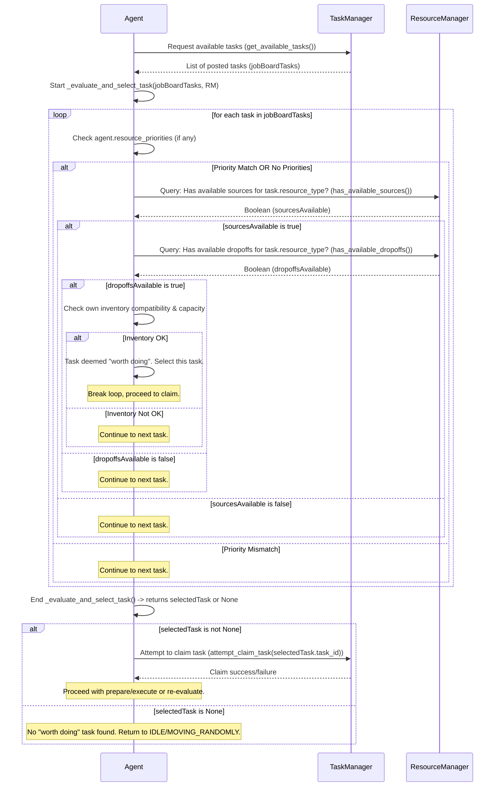

# Intelligent Agent Task Evaluation Plan

This document outlines the plan to enhance the `Agent`'s task selection logic, ensuring they only attempt "jobs worth doing." This involves agents performing preliminary checks on task feasibility *before* claiming a task from the job board. This plan builds upon the existing "Job Board Task Management System."

## 1. Core Principle: "A Job Worth Doing"

An agent will consider a task (specifically a `GatherAndDeliverTask` for now) "worth doing" if it meets the following criteria *prior* to attempting a claim:

1.  **Resource Availability at Source:** There must be at least one accessible `ResourceNode` of the required type that currently has a minimum quantity of resources available (e.g., `current_quantity >= 1`).
2.  **Space at Dropoff:** There must be at least one accessible `StoragePoint` (or relevant `ProcessingStation`) that accepts the resource type and has available capacity for reservation/dropoff.
3.  **Agent's Inventory Compatibility & Capacity:**
    *   If the agent is carrying a *different* resource type than the task requires, it must have sufficient *remaining* inventory capacity to make the new task worthwhile.
    *   If the agent's inventory is full of a different resource, it should generally not pick a task for a new resource type unless specific conditions are met (e.g., high priority task, ability to discard current inventory - not planned for now).
4.  **Alignment with `resource_priorities`:** The task should align with the agent's defined `resource_priorities`, if any. Tasks matching priorities are preferred.

If a task fails any of these preliminary checks, the agent will not attempt to claim it at that moment and will continue evaluating other tasks or return to an idle/random movement state.

## 2. System Flow Diagram (Focus on Agent Evaluation)

## 3. Detailed Changes by Component

### 3.1. `Agent` (`agents/agent.py`)

*   **Modified `_evaluate_and_select_task(self, available_tasks: List['Task'], resource_manager: 'ResourceManager') -> Optional['Task']`:**
    *   This method will be significantly enhanced.
    *   It will iterate through `available_tasks`. For each `GatherAndDeliverTask`:
        1.  **Filter by `resource_priorities`:** If `self.resource_priorities` exist, tasks not matching these priorities might be skipped or considered lower preference.
        2.  **Check Source Availability:** Call a new `resource_manager.has_available_sources(task.resource_type_to_gather, min_quantity=1)` method. If `False`, skip this task.
        3.  **Check Dropoff Availability:** Call a new `resource_manager.has_available_dropoffs(task.resource_type_to_gather, min_capacity=1)` method. If `False`, skip this task.
        4.  **Check Agent Inventory:**
            *   If `self.current_inventory['quantity'] > 0` and `self.current_inventory['resource_type'] != task.resource_type_to_gather`:
                *   Check if `self.inventory_capacity - self.current_inventory['quantity']` is sufficient for a meaningful amount of `task.resource_type_to_gather`. If not, skip this task.
            *   If `self.current_inventory['quantity'] == self.inventory_capacity` and `self.current_inventory['resource_type'] != task.resource_type_to_gather`, skip this task (agent is full of something else).
        5.  If all checks pass, this task is a candidate. The agent might select the first such candidate, or if multiple candidates exist, it could use task priority (`task.priority`) or other heuristics (e.g., estimated proximity - future enhancement) to choose.
    *   If no task passes all checks, return `None`.
*   **`update()` method:**
    *   When `_evaluate_and_select_task()` returns `None`, the agent will transition to `MOVING_RANDOMLY` (or remain `IDLE` for a longer cooldown) before re-entering `EVALUATING_TASKS`. This ensures agents don't get stuck rapidly polling an empty/unsuitable job board.

### 3.2. `ResourceManager` (`resources/manager.py`)

*   **New Query Methods (Read-Only Checks):**
    *   `has_available_sources(self, resource_type: ResourceType, min_quantity: int = 1) -> bool`:
        *   Iterates through `self.nodes`.
        *   Returns `True` if any `ResourceNode` matches `resource_type` and has `current_quantity >= min_quantity` and is *not* currently claimed by another task (`claimed_by_task_id is None`).
        *   Returns `False` otherwise.
    *   `has_available_dropoffs(self, resource_type: ResourceType, min_capacity: int = 1) -> bool`:
        *   Iterates through `self.storage_points`.
        *   Returns `True` if any `StoragePoint` accepts `resource_type` and `get_available_capacity_for_reservation() >= min_capacity`.
        *   (Future: Could also check `ProcessingStation` input buffers if tasks involve delivering to them).
        *   Returns `False` otherwise.
    *   These methods are crucial for agents to make informed decisions without prematurely affecting the state of resources (i.e., without claiming or reserving).

### 3.3. `Task` (`tasks/task.py`) and `TaskManager` (`tasks/task_manager.py`)

*   No direct changes are anticipated for these components as part of *this specific plan*, as the focus is on the agent's pre-claim evaluation. However, the success rate of `Task.prepare()` should improve due to more intelligent agent pre-selection.
*   The `TaskManager` will continue to re-post tasks if `prepare()` or `execute_step()` still lead to a failure, but the frequency of such immediate re-postings due to initial conditions should decrease.

## 4. Benefits of This Refinement

*   **Reduced Wasted Agent Cycles:** Agents will spend less time attempting to claim and prepare tasks that are currently impossible (e.g., no resources available at source, no space at dropoff).
*   **More Realistic Agent Behavior:** Agents will appear more intelligent, idling or moving randomly when there are no genuinely viable jobs, rather than repeatedly failing.
*   **Improved System Performance (Potentially):** Fewer failed `prepare()` calls and less task churn (claim -> fail -> re-post -> re-claim) can lead to a more efficient simulation.
*   **Clearer Debugging:** When agents are idle, it will be more indicative of a genuine lack of "worthwhile" work in the simulation according to their defined criteria.

## 5. Next Steps (Implementation Order)

1.  Implement the new query methods (`has_available_sources`, `has_available_dropoffs`) in `ResourceManager`.
2.  Refactor `Agent._evaluate_and_select_task()` to incorporate the new evaluation criteria using the `ResourceManager` query methods and agent inventory checks.
3.  Test thoroughly to ensure agents correctly identify "worthwhile" tasks and behave as expected when no such tasks are available.

This plan focuses on making the agent's decision *before* claiming a task more robust.