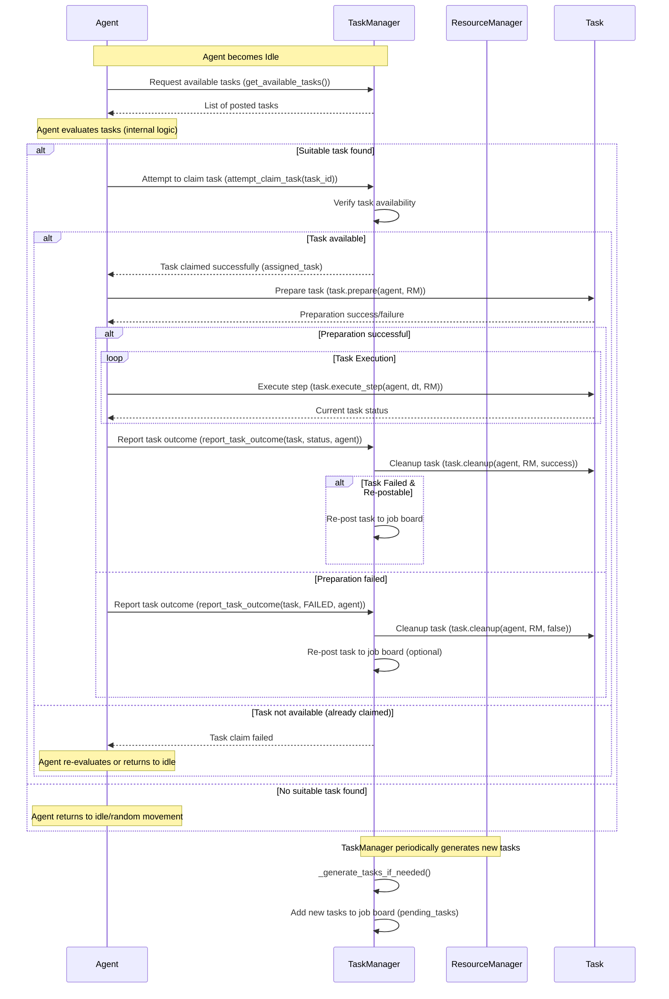

# Job Board Task Management System Plan

This document outlines the plan to transition the current task management system to a "job board" model. In this model, the `TaskManager` posts available tasks, and `Agents` autonomously evaluate and select tasks to undertake. This approach aims to increase agent autonomy, system robustness, and flexibility in task handling.

## 1. Core Concepts

*   **Job Board:** A central repository (likely evolving from the current `TaskManager.pending_tasks` list) where all available tasks are posted.
*   **Agent-Driven Selection:** `Agents` will proactively query the job board, evaluate tasks based on their internal logic and current state, and decide which tasks to attempt.
*   **Task Claiming:** A mechanism for agents to "claim" a task from the job board, ensuring that a task is worked on by only one agent at a time.
*   **Resilient Failure Handling:** Failed tasks can be re-posted to the job board, potentially with modifications, allowing for re-attempts by the same or different agents.

## 2. System Flow Diagram

## 3. Detailed Changes by Component

### 3.1. `TaskManager` (`tasks/task_manager.py`)

*   **Task Posting:**
    *   Newly generated tasks (via `_generate_tasks_if_needed()`) will be added to the `pending_tasks` list, which now serves as the job board.
    *   Tasks on the board will have a status like `TaskStatus.PENDING` or a new `TaskStatus.POSTED`.
*   **New/Modified Methods:**
    *   `get_available_tasks() -> List[Task]`: Returns a list of tasks currently on the job board (from `pending_tasks`).
    *   `attempt_claim_task(task_id: uuid.UUID, agent: 'Agent') -> Optional[Task]`:
        *   Checks if the task with `task_id` is still in `pending_tasks`.
        *   If available, removes it from `pending_tasks`, assigns it to the `agent` (sets `task.agent_id`, adds to `assigned_tasks`), and returns the `Task`.
        *   If not available (e.g., already claimed), returns `None`.
    *   `report_task_outcome(task: Task, final_status: TaskStatus, agent: 'Agent')`:
        *   Will be enhanced to handle re-posting. If `final_status` is `FAILED` and the task is deemed re-postable, it will be added back to `pending_tasks` (possibly after a delay or with modifications).
*   **Deprecated Methods:**
    *   `request_task_for_agent()`: This method will be removed or its functionality significantly reduced, as agents will now pull tasks.
*   **`update()` Method:**
    *   May include logic to manage stale tasks on the job board (e.g., increase priority, modify, or eventually remove tasks that remain unclaimed for too long).

### 3.2. `Agent` (`agents/agent.py`)

*   **State Management:**
    *   A new `AgentState` will be introduced, e.g., `EVALUATING_TASKS`.
*   **Modified `update()` Logic:**
    *   When `self.current_task is None` and `self.state == AgentState.IDLE`:
        1.  Transition to `AgentState.EVALUATING_TASKS`.
        2.  Call `self.task_manager_ref.get_available_tasks()`.
        3.  Execute a new internal task evaluation method (see below).
        4.  If a suitable task is chosen, call `self.task_manager_ref.attempt_claim_task(chosen_task.task_id, self)`.
        5.  If `attempt_claim_task` is successful:
            *   Set `self.current_task` to the claimed task.
            *   Call `self.current_task.prepare(self, resource_manager)`.
            *   Handle the result of `prepare()` (proceed to execution or report failure).
        6.  If no task is chosen or claim fails, the agent might revert to `MOVING_RANDOMLY` or re-attempt evaluation after a delay.
*   **New Internal Method: `_evaluate_and_select_task(self, available_tasks: List['Task'], resource_manager: 'ResourceManager') -> Optional['Task']`:**
    *   This method will contain the agent's decision-making logic.
    *   It will iterate through `available_tasks` and evaluate them based on:
        *   **Task Type & Requirements:** Compatibility with agent capabilities.
        *   **Agent's `resource_priorities`**.
        *   **Agent's Current State:** `current_inventory` (capacity, type of resource carried).
        *   **Task Feasibility:** Proximity (estimated), perceived difficulty, availability of resources (preliminary check using `resource_manager`).
    *   Returns the selected `Task` object or `None` if no suitable task is found.
*   **`resource_priorities`:** This attribute will become central to the agent's task selection logic.

### 3.3. `Task` (`tasks/task.py`)

*   **Information for Evaluation:**
    *   Tasks might need to expose more summary information accessible before `prepare()` to aid agents in their evaluation. This could include:
        *   Target resource type(s).
        *   Target quantity.
        *   General location hints (if applicable, without requiring full `prepare()`-level resource locking).
    *   The `get_target_description()` method could be enhanced, or new properties added.
*   **`prepare()` Method:**
    *   Remains critical for detailed validation, resource claiming, and reservation *after* an agent has claimed the task. If `prepare()` fails, the task is reported as failed to the `TaskManager`, which may then re-post it.

### 3.4. `TaskStatus` (`tasks/task_types.py`)

*   **New Status (Optional):** Consider adding `POSTED` to explicitly indicate tasks on the job board, distinct from `PENDING` (which might mean created but not yet ready for the board). Alternatively, `PENDING` can continue to serve this role.
*   **Lifecycle:** The status lifecycle will need to accommodate tasks returning to the job board after a failure (e.g., `FAILED` -> `POSTED`/`PENDING`).

## 4. Benefits

*   **Increased Agent Autonomy:** Agents make more decisions about their work.
*   **Decentralization:** Reduces the `TaskManager`'s role as a direct assigner.
*   **Improved Robustness & Resilience:** Failed tasks are not necessarily lost. They can be re-attempted by other agents or the same agent under different conditions, making the system more tolerant to transient issues (e.g., a resource node being temporarily depleted or claimed).
*   **Flexibility:** The system can adapt better to varying numbers of agents or agents with different specializations or efficiencies.

## 5. Potential Challenges & Considerations

*   **Increased Complexity:** Agent logic for task evaluation will be more sophisticated. The `TaskManager` also gains new responsibilities for managing the job board and re-posting logic.
*   **Task Starvation:** Some tasks might remain on the board if no agent deems them suitable. The `TaskManager.update()` might need logic to escalate the priority of, modify, or eventually expire such tasks.
*   **Concurrency in Claiming:** The `attempt_claim_task` method in `TaskManager` must be robust to handle near-simultaneous claims for the same task, ensuring only one agent successfully claims it.
*   **Performance:** Frequent querying of the job board by many agents could have performance implications if not managed efficiently.
*   **Agent Oscillation:** Agents might repeatedly pick up and drop tasks if evaluation criteria are not well-defined or if the environment changes rapidly.

This plan provides a foundational architecture for the job board system. Further refinement of agent evaluation heuristics and `TaskManager` policies for re-posting and managing stale tasks will be necessary during implementation.